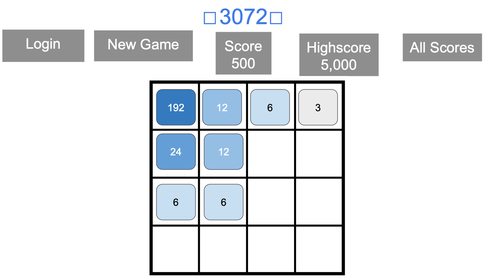
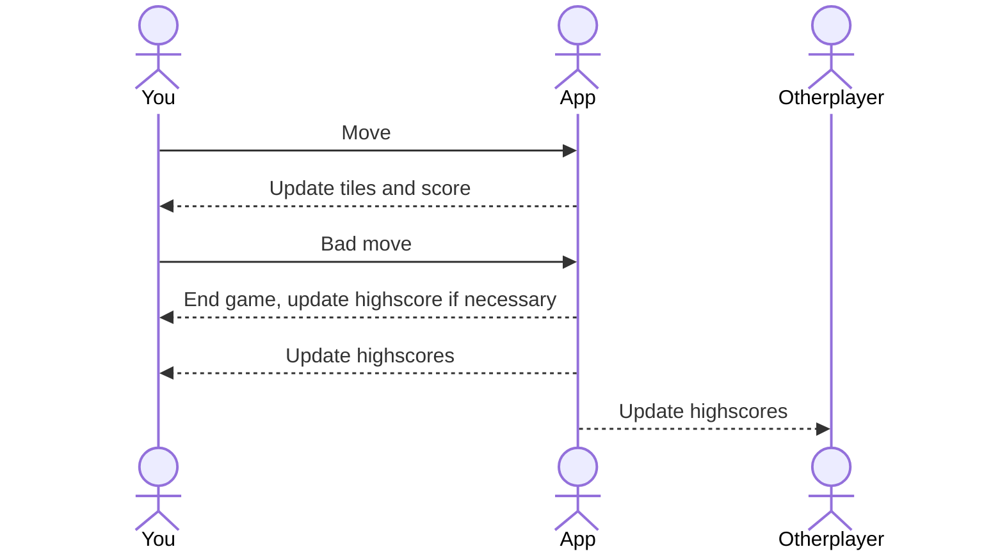

# 3072

[My Notes](notes.md)

3072 is game that is played on a 4x4 grid. This game is played by using the arrow keys to slide the numbers in the direction of your choice. When an arrow it pressed the numbers slide as far to that direction as possible. Each time you slide a number a new number consisting of 3 or 6 will appear. If 2 of the same numbers slide into each other they will combine. The object of the game is to get the highest score possible and the game is over when the board is full and it is not possible to slide anymore.

> [!NOTE]
> This is a note I want to keep here to add notes in the future.

## 🚀 Specification Deliverable

For this deliverable I did the following. I checked the box `[x]` and added a description for things I completed.

- [x] Proper use of Markdown
- [x] A concise and compelling elevator pitch
- [x] Description of key features
- [x] Description of how you will use each technology
- [x] One or more rough sketches of your application. Images must be embedded in this file using Markdown image references.

### Elevator pitch

Do you think you could get your highest number to 3072? Challenge yourself with this fun, simple game of strategy and addition!

If there are times in your day where you need a break from school, are bored, or stressed, you may think to yourself, "What could I do to fill this time?" 3072 is the perfect game that keeps your brain awake while allowing you to take a break from what you're doing or simply entertain the mind when you're bored. Play whenever and as long as you like. Give it a try!

### Design

Here is a sequence Diagram showing how users interact with the application to move pieces and increment tiles.

### Key features

- Secure login over HTTPS
- Highscore displayed and saved for each time you play
- Total score displayed in realtime
- Display of board and numbers
- Automatic addition of variables when combined
- Display of numbers sliding to different positions

### Technologies

I am going to use the required technologies in the following ways.

- **HTML** - Structure the basic layout of the webpage and game including the main gameboard, buttons, and score displays
- **CSS** - Application styling such as colors and shape of number tiles, board layout, animations for tile movement and merging, and other styling for compatability with different devices.
- **React** - Interactive user interface. Handle the game state, manage tile movements and merges, update scores, and start new game.
- **Service** - Implement games core logic such as moving tiles, merging tiles, checking game over conditions, and calculating scores, getting images from another api.
- **DB/Login** - Save data of user logins and highscores in database.
- **WebSocket** - Highscores are saved for everyone to see, live leaderboard.

## 🚀 AWS deliverable

For this deliverable I did the following. I checked the box `[x]` and added a description for things I completed.

- [x] **Server deployed and accessible with custom domain name** - [My server link](https://yourdomainnamehere.click).

## 🚀 HTML deliverable

For this deliverable I did the following. I checked the box `[x]` and added a description for things I completed.

- [ ] **HTML pages** - I added pages for each of the pages I need to display by adding a menu with a list of the different links to the other pages.
- [ ] **Proper HTML element usage** - I structured the elements in a way that works smoothyl and looks good.
- [ ] **Links** - I created links that connect to each page in the application and to my github startup page
- [ ] **Text** - I imputed text containing an explaination of how the game works and my elevator pitch.
- [ ] **3rd party API placeholder** - I did not complete this part of the deliverable.
- [ ] **Images** - I did not complete this part of the deliverable.
- [ ] **Login placeholder** - I did not complete this part of the deliverable.
- [ ] **DB data placeholder** - I did not complete this part of the deliverable.
- [ ] **WebSocket placeholder** - I did not complete this part of the deliverable.

## 🚀 CSS deliverable

For this deliverable I did the following. I checked the box `[x]` and added a description for things I completed.

- [ ] **Header, footer, and main content body** - I did not complete this part of the deliverable.
- [ ] **Navigation elements** - I did not complete this part of the deliverable.
- [ ] **Responsive to window resizing** - I did not complete this part of the deliverable.
- [ ] **Application elements** - I did not complete this part of the deliverable.
- [ ] **Application text content** - I did not complete this part of the deliverable.
- [ ] **Application images** - I did not complete this part of the deliverable.

## 🚀 React part 1: Routing deliverable

For this deliverable I did the following. I checked the box `[x]` and added a description for things I completed.

- [ ] **Bundled using Vite** - I did not complete this part of the deliverable.
- [ ] **Components** - I did not complete this part of the deliverable.
- [ ] **Router** - Routing between login and voting components.

## 🚀 React part 2: Reactivity

For this deliverable I did the following. I checked the box `[x]` and added a description for things I completed.

- [ ] **All functionality implemented or mocked out** - I did not complete this part of the deliverable.
- [ ] **Hooks** - I did not complete this part of the deliverable.

## 🚀 Service deliverable

For this deliverable I did the following. I checked the box `[x]` and added a description for things I completed.

- [ ] **Node.js/Express HTTP service** - I did not complete this part of the deliverable.
- [ ] **Static middleware for frontend** - I did not complete this part of the deliverable.
- [ ] **Calls to third party endpoints** - I did not complete this part of the deliverable.
- [ ] **Backend service endpoints** - I did not complete this part of the deliverable.
- [ ] **Frontend calls service endpoints** - I did not complete this part of the deliverable.

## 🚀 DB/Login deliverable

For this deliverable I did the following. I checked the box `[x]` and added a description for things I completed.

- [ ] **User registration** - I did not complete this part of the deliverable.
- [ ] **User login and logout** - I did not complete this part of the deliverable.
- [ ] **Stores data in MongoDB** - I did not complete this part of the deliverable.
- [ ] **Stores credentials in MongoDB** - I did not complete this part of the deliverable.
- [ ] **Restricts functionality based on authentication** - I did not complete this part of the deliverable.

## 🚀 WebSocket deliverable

For this deliverable I did the following. I checked the box `[x]` and added a description for things I completed.

- [ ] **Backend listens for WebSocket connection** - I did not complete this part of the deliverable.
- [ ] **Frontend makes WebSocket connection** - I did not complete this part of the deliverable.
- [ ] **Data sent over WebSocket connection** - I did not complete this part of the deliverable.
- [ ] **WebSocket data displayed** - I did not complete this part of the deliverable.
- [ ] **Application is fully functional** - I did not complete this part of the deliverable.
